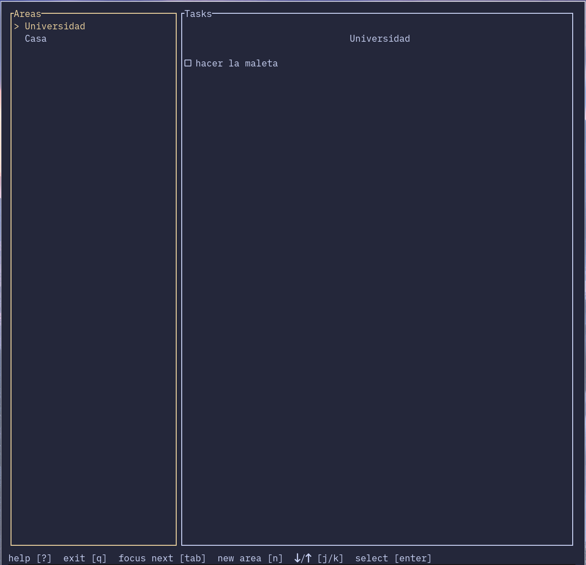

# Rustydo

This is a terminal based TODO list made with Rust, using the [ratatui](https://ratatui.rs/) crate.



## How to use

### Prerequisites

You just need [Docker](https://www.docker.com/) installed on your local machine to run this application.

### Try it

Once you have Docker installed, run the following command in the root directory of the project:
```shell
make
```
Yes, as simple as that, and Docker will do everything for you.

Check out the `Makefile` and the `Dockerfile` to see what is going on during the building process of the application.

## TODO

- Component Architecture:
    - `input.rs` into `ui` folder. Make it implement `Widget`.
    - Create `components` folder and add `area`, `task` and `help` components.
- Functionality:
    - Create new tasks for the current Area.
    - Delete, modify, check tasks.
- More...
