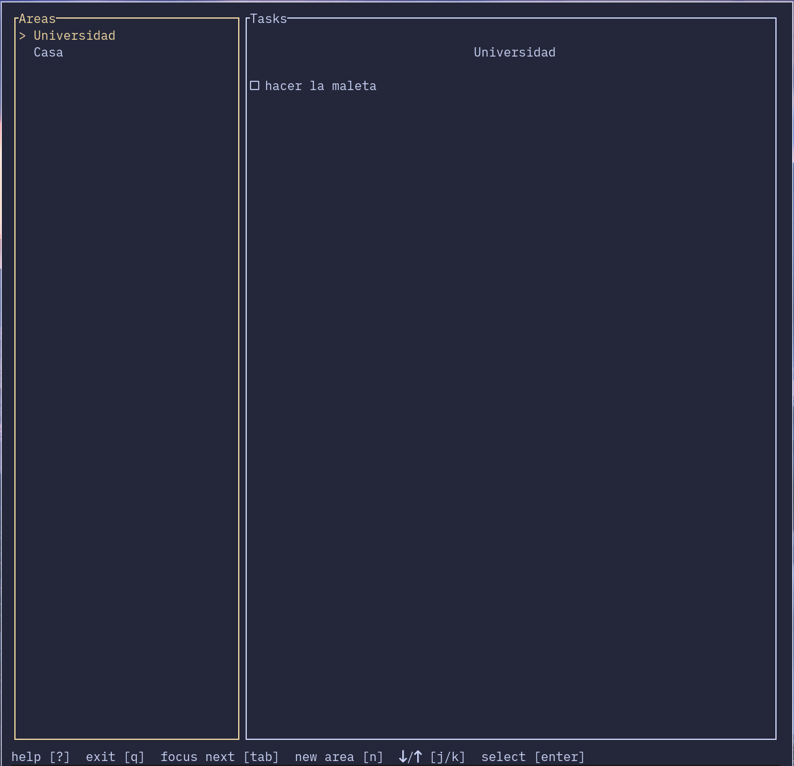

# Rustydo

This is a terminal based TODO list made with Rust, using the [ratatui](https://ratatui.rs/) crate.



## How to use

Run the following command in the root directory of the project:

```shell
make build && make
```

or

```shell
just b r
```

Yes, as simple as that, and Docker will do everything for you.

Check out the `Makefile` and the `Dockerfile` to see what is going on during the building process of the application.

## TODO

- Functionality:
    - Create new tasks for the current Area.
    - Delete, modify, check tasks.
- Architecture:
    - Implement `Frame` struct to frames.
